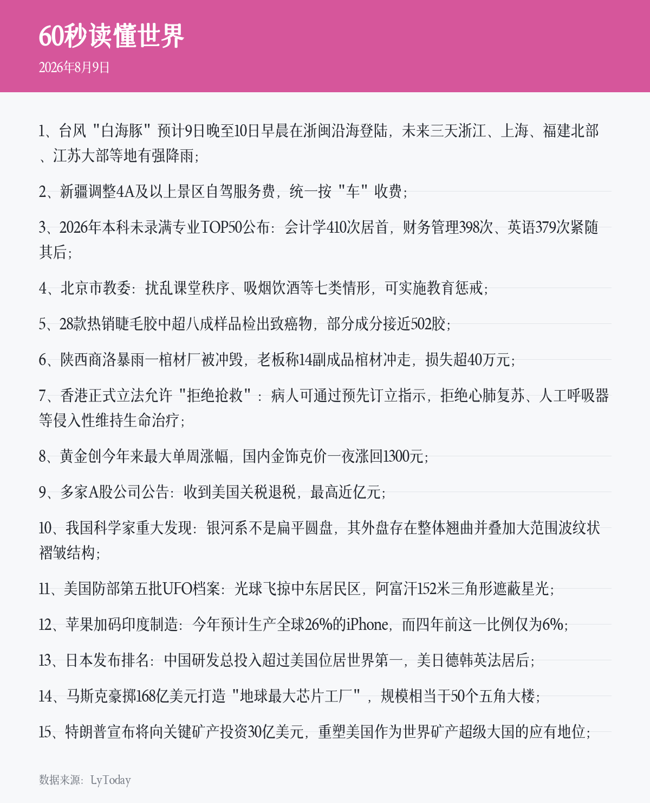

# MIE News Reporter

MIE News Reporter 是基于 [MieBot](https://github.com/alanqoq/miebot) 插件 API 3.2.0 的 QQ 群日报插件，使用 Kotlin/JVM 21 开发。插件 ID 为 `mienr`，当前提供今日新闻和今日番剧的指令获取与每日定时推送。

## 功能

- 新闻和番剧按群独立开关，默认都不启用。
- 主指令和全部七条子指令都可配置多个别名，默认均为空。
- 群管理员和群主可在群内切换开关、设置该群的独立推送小时。
- 普通群员可手动获取已启用的新闻或番剧，图片和禁用提醒都使用显式消息引用。
- 默认时间与群独立时间均使用严格 `HH` 格式，范围 `00`-`23`。
- 每类内容每天只抓取和生成一次，同日并发请求共用同一个生成任务。
- 自动推送按“群 + 类型 + 日期”持久化去重，同一小时内重启插件也不会重复推送。

## 指令

| 指令 | 权限 | 说明 |
| --- | --- | --- |
| `/mienr news` | 管理员/群主 | 开启或关闭本群今日新闻推送 |
| `/mienr timenews HH` | 管理员/群主 | 设置本群新闻推送小时 |
| `/mienr getnews` | 群内所有成员 | 引用回复今日新闻；未启用时回复配置提醒 |
| `/mienr anime` | 管理员/群主 | 开启或关闭本群今日番剧推送 |
| `/mienr timeanime HH` | 管理员/群主 | 设置本群番剧推送小时 |
| `/mienr getanime` | 群内所有成员 | 引用回复今日番剧；未启用时回复配置提醒 |
| `/mienr help` | 群内所有成员 | 显示全部指令、权限和用法 |

这些指令只处理 QQ 普通群消息。非群消息、无法确定成员角色的管理指令都不会放行。

## 配置

插件默认使用 `config.yml`：

```yaml
timeZone: "Asia/Shanghai"

commands:
  aliases:
    mienr: []
    news: []
    timenews: []
    getnews: []
    anime: []
    timeanime: []
    getanime: []
    help: []

news:
  enabledGroups: []
  defaultTime: "10"
  groupTimes: {}
  disabledMessage: "本群尚未启用今日新闻推送，请联系群管理员使用 /mienr news 开启。"
  failureMessage: "今日新闻获取失败，请稍后重试。"

anime:
  enabledGroups: []
  defaultTime: "10"
  groupTimes: {}
  disabledMessage: "本群尚未启用今日番剧推送，请联系群管理员使用 /mienr anime 开启。"
  failureMessage: "今日番剧获取失败，请稍后重试。"
```

- `enabledGroups` 由开关指令自动维护；关闭某类推送时，同时删除该类的群独立时间。
- `defaultTime` 是该类内容的默认每日推送小时。
- `groupTimes` 的键是群 OpenID，值是群独立小时；存在时优先于 `defaultTime`。
- 时间值必须带引号，例如 `"00"` 和 `"09"`，数字 `9` 不符合格式。
- `disabledMessage` 是未启用时的引用回复；`failureMessage` 是手动生成失败时的引用回复。
- `commands.aliases` 必须完整列出 `mienr` 和七条子指令；`[]` 表示没有别名。
- 别名字符串不包含开头的 `/`，也不能包含空白或与其他别名、规范指令名重复。
- 例如把 `mienr` 设为 `["日报"]`、`anime` 设为 `["开启今日番剧"]` 后，`/日报 anime`、`/开启今日番剧` 和 `/日报 开启今日番剧` 都可以触发对应指令。
- 时间指令的别名仍然需要携带 `HH`，例如 `/设置新闻时间 08`。修改别名后需重载插件配置。

## 图片与数据源

- 新闻数据来自 `https://cdn.lylme.com/api/60s/`，插件校验业务状态、当天日期、条目数和总文本量，再用内置中文字体生成 PNG。
- 番剧数据来自 Bilibili 番剧时间线，插件选取当天且未延期条目，通过 MieBot `PluginHttpClient` 下载封面后排版为 PNG。
- 缓存文件为 `news-YYYYMMDD.png` 和 `anime-YYYYMMDD.png`，位于当前机器人的插件绑定私有目录。
- 调度器在日期变化后主动删除两类旧 PNG；读取当天缓存时也会再次清理。
- 旧项目的“摸鱼日历”不在本插件需求内，也不会打包进 `MIE News Reporter`。

## 构建与验证

需要 JDK 21。Linux/WSL 运行 AWT 图片渲染还需要 `fontconfig`/`libfontconfig1` 等系统字体运行库。默认从 `../../miebot/build/plugin-sdk/repository` 读取 MieBot `1.0.6` SDK，也可使用 `QQBOT_SDK_REPOSITORY` 或 `-PqqbotSdkRepository=/path/to/repository` 指定。

```bash
export JAVA_HOME=/path/to/jdk-21
./gradlew clean test jar
```

真实网络图片烟测不属于默认 JUnit，需要显式执行：

```bash
./gradlew onlineSmokeTest
```

烟测使用同一套生产抓取/渲染类，生成结果保存在 `generated-examples/`。插件 JAR 位于 `build/libs/mie-news-reporter-<version>.jar`。

## 安装

1. 执行 `./gradlew clean test jar` 构建 JAR。
2. 在 MieBot 后台“插件”页上传 JAR，或将它放入宿主插件目录（Compose 默认是 `./plugins`，容器内是 `/plugins`）。
3. 执行插件扫描/重新加载，确认状态为已加载。
4. 在机器人绑定页新增 `MIE News Reporter`，确认 YAML 配置后启用。
5. 在 QQ 群中由管理员或群主使用 `/mienr news` 和 `/mienr anime` 开启对应推送。

## 在线样例

2026-08-09 真实接口烟测已成功生成两类图片：




## License

GPL-3.0. See [LICENSE](LICENSE).
